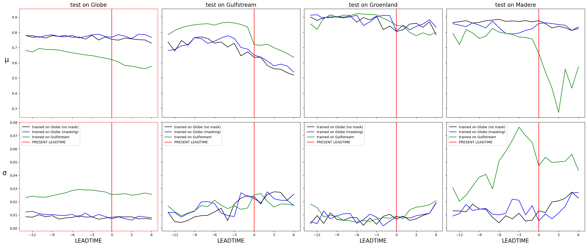

# 4DVAR-forecast-global
report on experiments of 4DVarNet on global scale

## Experiments:

- **Global (Masking)**: 4DVarNet-forecast is trained and used to forecast on the whole globe. Continents are masked in the prediction and training.

- **Global (No Mask)**: 4DVarNet-forecast is trained and used to forecast on the whole globe. Continents are initialized to `0.0f`.

- **Gulfstream**: 4DVarNet-forecast is trained to forecast on the Gulfstream patch only.

## Results

**metric per leadtime**

